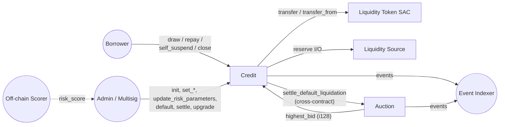

# Creditra Contracts

**Decentralized, risk-priced credit on Stellar / Soroban — without
overcollateralization.** Credit lines whose limit and interest rate evolve
continuously from on-chain behavioral signals, financial attestations, and a
formally specified risk-pricing function. Default events are settled through a
separate auction contract using a one-shot, replay-protected cross-contract
handoff.

This is the **Creditra-Contracts** workspace: two Soroban WebAssembly contracts,
about 14.5 KLOC of Rust, current line coverage **98.94 %**, release WASM under
a **50 KB hard CI budget**.

| Doc | What it answers |
|---|---|
| [`WHITEPAPER.md`](./WHITEPAPER.md) | Why and how — protocol-level model, math, comparison vs Aave/Compound/Maker |
| [`docs/PROTOCOL_SPEC.md`](./docs/PROTOCOL_SPEC.md) | Per-module contract surface: every entrypoint, every storage key, every error |
| [`docs/ARCHITECTURE.md`](./docs/ARCHITECTURE.md) | System & sequence diagrams (mermaid); call topology |
| [`docs/RISK_PRICING.md`](./docs/RISK_PRICING.md) | The risk-pricing algorithm in depth, with worked numerical examples |
| [`docs/SECURITY.md`](./docs/SECURITY.md) | Threat model, auditor checklist, bug bounty scope |
| [`docs/EXECUTION_QUALITY.md`](./docs/EXECUTION_QUALITY.md) | Test catalog, CI matrix, deployment checklists, PR cadence |

---

## The differentiator

Aave / Compound / Maker require **150 %+ overcollateralization**, which gates
the median wallet out of on-chain credit. Creditra computes a credit limit and
an interest rate from a **deterministic on-chain function** of the borrower's
behavioral history and risk score:

$$
r(k) = \mathrm{clamp}(b + k \cdot s, \; r_{\min}, \; \min(r_{\max}, 10\,000))
$$

— where $k$ is the risk score and $(b, s, r_{\min}, r_{\max})$ are the
admin-set rate-formula parameters (`contracts/credit/src/risk.rs:77`). The
contract supports an *optional* collateral floor (default 150 %) that an
operator can dial between fully unsecured and Aave-style — but the eligibility
predicate is **behavior**, not deposit.

See [`WHITEPAPER.md`](./WHITEPAPER.md) for the full design.

---

## Architecture (at a glance)



| Crate | Path | Role |
|---|---|---|
| `creditra-credit` | `contracts/credit/` | Credit-line core: open / draw / repay / risk update / default / settle / upgrade. `lib.rs` is 5 449 lines, 13 sub-modules. |
| `gateway-auction` | `gateway-contract/contracts/auction_contract/` | Minimal English & Dutch auction; one-shot settlement handoff back to credit. |

Full module catalog and entrypoint signatures: [`docs/PROTOCOL_SPEC.md`](./docs/PROTOCOL_SPEC.md).
Sequence diagrams for draw, repay, default → auction → settle:
[`docs/ARCHITECTURE.md`](./docs/ARCHITECTURE.md).

---

## Quick start

### Prerequisites

- Rust 1.75+ (recommend latest stable)
- `wasm32-unknown-unknown` target:
  ```bash
  rustup target add wasm32-unknown-unknown
  ```
- [Stellar Soroban CLI](https://developers.stellar.org/docs/smart-contracts/getting-started/setup) for deploy/invoke.

### Build

```bash
# Workspace build (no WASM)
cargo build

# Release WASM, size-optimized
cargo build --release --target wasm32-unknown-unknown -p creditra-credit
# Output: target/wasm32-unknown-unknown/release/creditra_credit.wasm (< 50 KB)
```

The release profile (`Cargo.toml`) is tuned for contract size:
`opt-level = "z"`, `lto = true`, `strip = "symbols"`, `codegen-units = 1`,
`panic = "abort"`, and — unusually — `overflow-checks = true` even in release,
so the entire `i128` accounting layer reverts on overflow instead of wrapping.

### Test

```bash
cargo test --workspace
```

### Coverage

```bash
cargo llvm-cov --workspace --all-targets --fail-under-lines 95
# Current: 99.51 % regions, 98.94 % lines
```

### Deploy (testnet)

```bash
soroban contract deploy \
  --wasm target/wasm32-unknown-unknown/release/creditra_credit.wasm \
  --source <identity> --network testnet
soroban contract invoke --id <addr> --source <identity> --network testnet -- init --admin <admin-addr>
```

Full testnet + mainnet checklists are in
[`docs/EXECUTION_QUALITY.md`](./docs/EXECUTION_QUALITY.md) §6.

---

## Repo map (where to look)

```
Creditra-Contracts/
├── WHITEPAPER.md              # Protocol-level design (this is the centerpiece)
├── README.md                  # You are here
├── Cargo.toml                 # Workspace + release profile
├── contracts/credit/
│   ├── Cargo.toml
│   └── src/
│       ├── lib.rs             # #[contract] Credit + all entrypoints (5449 LOC)
│       ├── types.rs           # 38-variant ContractError, CreditStatus, configs
│       ├── storage.rs         # 30-variant DataKey, TTL constants, helpers
│       ├── auth.rs            # require_admin / require_admin_auth
│       ├── config.rs          # init, set_liquidity_*
│       ├── borrow.rs          # draw_status_error helper
│       ├── collateral.rs      # deposit/withdraw + MinCollateralRatioBps
│       ├── freeze.rs          # global draws-frozen toggle
│       ├── lifecycle.rs       # state transitions + settle_default_liquidation
│       ├── risk.rs            # compute_rate_from_score, update_risk_parameters
│       ├── accrual.rs         # apply_accrual + grace/penalty branches
│       ├── math_utils.rs      # mul_div, prorate_interest, Rounding
│       ├── query.rs           # read-only helpers, is_delinquent
│       └── events.rs          # 25+ #[contracttype] payload structs
│   └── tests/                 # 42 integration test files
├── gateway-contract/contracts/auction_contract/
│   └── src/
│       ├── lib.rs             # Auction contract (English + Dutch modes)
│       ├── types.rs           # AuctionMode, AuctionStatus, AuctionState
│       ├── storage.rs         # DataKey + persistent AuctionKey, TTLs
│       ├── events.rs          # BidRefundedEvent, AuctionClosedEvent, ...
│       ├── errors.rs          # AuctionError (12 variants)
│       └── test.rs            # 1 934 lines of tests
├── docs/                      # Long-form references (state machine, errors,
│                              # storage layout, threat model, accrual,
│                              # rate formula, indexer integration, …)
└── scripts/                   # Operator helpers (build, check, error introspection)
```

Per-entrypoint signatures, validation order, storage keys, and error returns:
[`docs/PROTOCOL_SPEC.md`](./docs/PROTOCOL_SPEC.md).

---

## What's in the box

### Credit contract entrypoints

`Credit` (`#[contract]`, `#[contractimpl]` in `contracts/credit/src/lib.rs`):

- **Init & admin rotation:** `init`, `propose_admin`, `accept_admin`,
  `get_contract_version`.
- **Credit-line CRUD:** `open_credit_line`, `draw_credit`, `repay_credit`,
  `close_credit_line`, `suspend_credit_line`, `self_suspend_credit_line`,
  `default_credit_line`, `reinstate_credit_line`, `forgive_debt`.
- **Risk parameters:** `update_risk_parameters`, `set_rate_formula_config` /
  `clear_rate_formula_config`, `set_rate_change_limits`,
  `set_borrower_rate_floor`, `set_penalty_surcharge_bps`,
  `set_grace_period_config`.
- **Caps & limits:** `set_max_draw_amount`, `set_max_repay_amount`,
  `set_draw_min_interval`, `set_utilization_cap`, `set_max_total_exposure`,
  `set_credit_limit_bounds`.
- **Liquidity & treasury:** `set_liquidity_token`, `set_liquidity_source`,
  `set_protocol_fee_bps`, `set_treasury`, `withdraw_treasury`.
- **Collateral (optional):** `deposit_collateral`, `withdraw_collateral`.
- **Repayment schedule:** `set_repayment_schedule`, `get_repayment_schedule`,
  `is_delinquent`.
- **Operational controls:** `pause_protocol` / `unpause_protocol`,
  `freeze_draws` / `unfreeze_draws`, `block_borrower` / `unblock_borrower` /
  `bulk_block_borrowers`, `accrue_batch`, `reverse_draw`.
- **Auction & oracle:** `set_auction_contract`,
  `settle_default_liquidation`, `set_oracle_config`.
- **Upgrade:** `upgrade(new_wasm_hash)`.
- **Queries:** 20+ read-only `get_*` / `enumerate_*` / `is_*` entrypoints.

### Auction contract entrypoints

`Auction` (`#[contract]`,
`gateway-contract/contracts/auction_contract/src/lib.rs`):

- `init_auction(auction_id, mode, start_time, end_time, min_bid, min_increment_bps, dutch_start_price, dutch_floor_price)`
- `set_factory_contract(factory)`
- `place_bid(auction_id, bidder, amount)` — English ascending or Dutch
  descending mode, with anti-grief minimum increment and reentrancy-guarded
  refund of the prior bidder
- `close_auction(auction_id)`
- `settle_default_liquidation(auction_id, credit_contract, borrower) -> i128`
  — factory-only, one-shot per `auction_id`
- `claim_auction(auction_id)` — winner-only

---

## Status & roadmap

### Shipped (current `main`)

- Credit-line core with 38-variant `ContractError`, 30-variant `DataKey`,
  25+ events; pinned by CI tests.
- Risk-pricing formula (`compute_rate_from_score`), per-borrower floor,
  rate-change cap, penalty surcharge, grace policy.
- Lazy interest accrual with three branches (current, delinquent, grace).
- English & Dutch auction modes; reentrancy-guarded refunds.
- Cross-contract default-liquidation handoff with two-sided replay
  protection.
- Oracle deviation & staleness circuit breaker.
- Admin-gated WASM upgrade with schema version bump.
- Circuit breaker (`pause_protocol`) with repay-credit exception.
- Treasury + protocol fee on interest portion.
- Per-borrower utilization cap, global exposure cap, draw cooldown, per-tx
  caps.
- Collateral as an *optional* (default-on) floor.
- Borrower self-suspend.
- Storage TTL hygiene with automatic bump on access.
- 42 integration test files, ~817 `#[test]` annotations, 98.94 % line
  coverage in CI.

### Next milestones

- **Anti-snipe extension** for English auctions (documented in PR #430, not
  yet active in `place_bid`).
- **Decentralized default-signal oracle** per `docs/default-oracle.md`
  (signed attestation, signer set, nonce replay protection).
- **Build-clean main** — resolve the merge-artifact duplicates in
  `lifecycle.rs` and `risk.rs` that produce the current `cargo check`
  errors (tracked in `IMPLEMENTATION_STATUS.md`).
- **Property-fuzz harness** (`cargo fuzz`) over `apply_accrual` and
  `compute_rate_from_score`.
- **External audit** (see `AUDIT_SUMMARY.md`).
- **Decentralized scorer pipeline** — move the off-chain scoring function
  to a stake-weighted committee or zk-attested compute.

---

## Conventions

- Edition: 2021. Toolchain: see `rust-toolchain.toml`.
- Style: `cargo fmt --check` enforced in CI; `cargo clippy -- -D warnings`
  enforced in CI.
- Errors: no production `unwrap()` / `expect()` (audited, PR #418 / #421).
  Every fallible path returns a `ContractError`.
- ABI stability: `ContractError` discriminants are pinned by
  `tests/error_discriminants.rs`; event topics by
  `tests/event_topic_stability.rs`.
- Commit style: conventional commits (`docs:`, `feat:`, `fix:`, `security:`,
  `chore:`, `test:`).
- Branching: feature branches off `main`, PRs reviewed and merged via
  GitHub.

---

## Helper scripts

| Script | Use |
|---|---|
| `scripts/build_wasm.sh [all\|credit\|auction]` | Build release-mode WASM artifacts |
| `scripts/check_workspace.sh [args]` | `cargo check --workspace` wrapper |
| `scripts/clean_profraw.sh [--dry-run]` | Remove stray `*.profraw` coverage profiles outside `target/` |
| `scripts/list_contract_errors.py [--json]` | Print every `ContractError` variant with its discriminant |

See [`scripts/README.md`](scripts/README.md) for conventions.

---

## License

See `Cargo.toml` for crate-level metadata. Both `creditra-credit` and
`gateway-auction` carry an SPDX license identifier; SPDX headers are
preserved by CI tests in `tests/spdx_header_preservation.rs` and
`tests/spdx_preservation_standalone.rs`.

---

## Verifying the headline claims

```bash
# Workspace topology
ls contracts/credit/tests/*.rs | wc -l                # 42 integration files
grep -r '#\[test\]' contracts/ gateway-contract/ | wc -l   # ~817 tests
git log --oneline | grep -c Merge                     # ~332 merged PRs

# Coverage
cargo llvm-cov --workspace --all-targets --fail-under-lines 95

# Size budget
cargo build --release --target wasm32-unknown-unknown -p creditra-credit \
  && ls -l target/wasm32-unknown-unknown/release/creditra_credit.wasm   # < 50 KB

# Error catalog
python3 scripts/list_contract_errors.py --json | jq 'length'   # 38
```

---

*For the long-form protocol description, start with [`WHITEPAPER.md`](./WHITEPAPER.md).*
